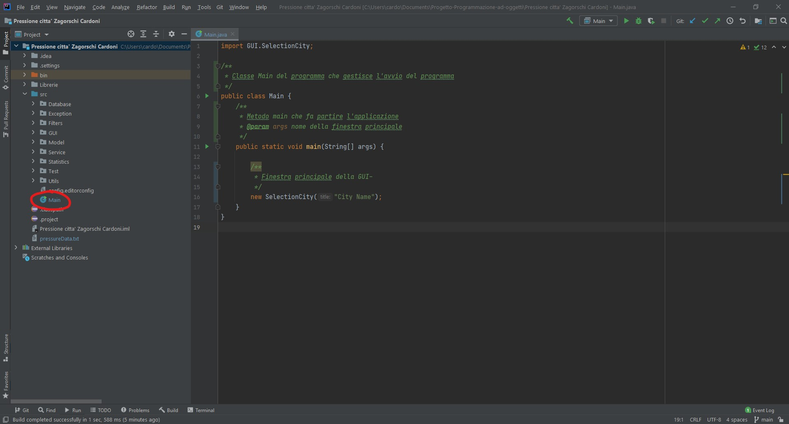
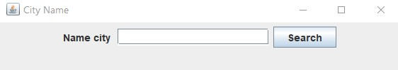
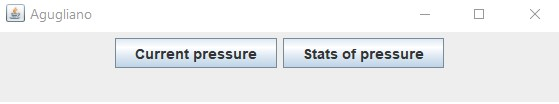
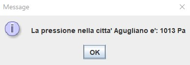
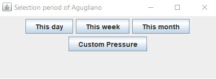
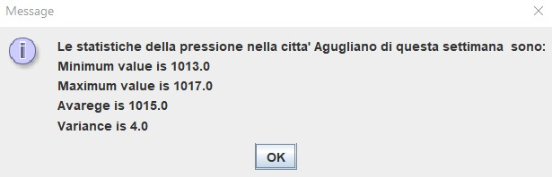
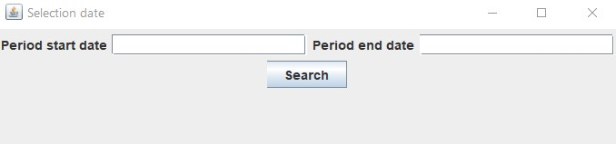
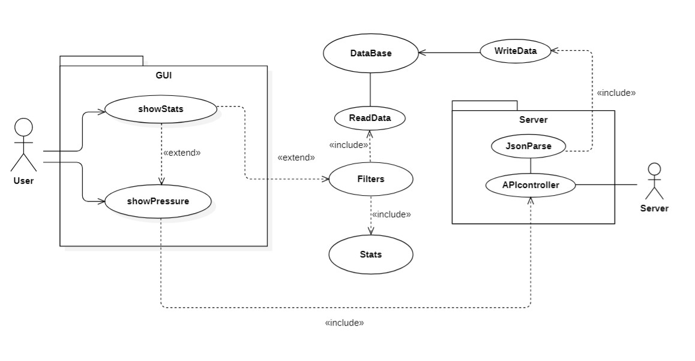
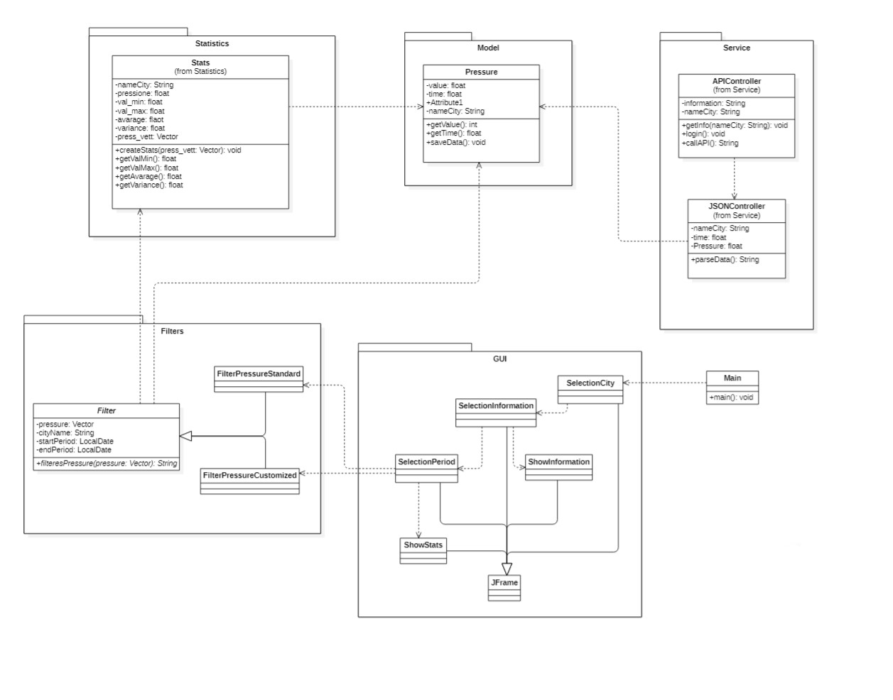
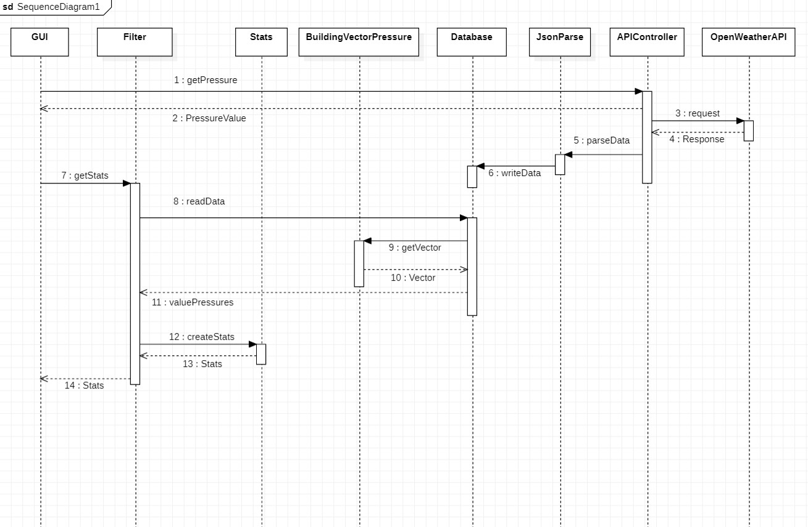

## Progetto OPENWEATHER - Città, pressione 
Il progetto permette all'utente di visualizzare la pressione di una certa città e le statistiche di un determinato periodo.

## Come usare l'applicazione
1. Scaricare codice sorgente
2. Aprire il progetto tramite un IDE
3. Aprire la cartella src del progetto
4. Fare il run della classe main

* Una volta avviato comparira' la seguente schermata che chiedera' all'utente di inserire un nome di una citta' (come ad esempio Agugliano o Pesaro). Se la citta' non esiste comparira' un messaggio di errore.

* Verra' chiesto all'utente se vuole visualizzare la pressione attuale o le statistiche di un determinato periodo.

* La pressione attuale verra' mostrata con una finestra

* Per visualizzare le statistiche di un periodo, si possono scegliere tra 3 periodi già preimpostati (giornaliero, settimanale e mensile) oppure un periodo personalizzato dall'utente.

* Schermata statistiche

* Per scegliere un periodo personalizzato ci sara' una apposita finestra dove inserire la data iniziale e la data finale. Se non si inseriscono le date, l'applicazione fara' comparire un messaggio di errore. Le date dovranno essere inserite nel formato "aaaa-mm-dd" e se verrano inserite in un formato errato l'utente sara' allertato da un messaggio.
L'ordine delle due date e' irrilevante, in quanto sara' il programma ad occuparsi di quale data viene prima o dopo.

* Per chiudere il programma chiudere tutte le finestre.

## UML
In fase di progettazione sono stati disegnati i seguenti diagrammi UML. Durante la realizzazione del progetto sono state eseguite varie modifiche a seconda delle esigenze. Le modifiche effettuate sono riportate sotto al proprio diagramma UML.

# Use case diagram

* l'utente si interfaccia al programma attraverso una GUI, a seconda dell'operazione scelta si esegue una certa richiesta. 
  Show Stats applica un filtro ai dati nel database, che vengono parsati da un'apposita classe. Succesivamente si creano le statistiche che vengono mostrate all'utente.
  I dati presenti nel database sono ottenuti, in formato JSON, da delle chiamate API.
  
# Class diagram

* Model: package contenente il formato dei dati.
* GUI: package con classi che implementano la GUI con cui l'utente interagirà.
* Service: package che si interfaccia all'API Openwheter, ottenendo i dati e parsandoli a seconda della necessità.
* Filters: package contenente una interfaccia per le classi filterPressureStandard e filterPressureCustomized. Le classi prenderanno in input un periodo, una città e i dati presenti nel database e in output un vettore contenente le pressioni filtrate. Il fitro standard avrà un periodo predefinito dal programmatore (un giorno, una settimana ed un mese), mentre il filtro personalizzato filtrerà i dati a seconda di un periodo deciso dall'utente.
*Statistics: package contenente la classe Stats che prende in input un vettore di pressioni e ne genera le relative statistice.

Nota: Nell'UML non sono presenti i seguenti package
* DataBase: package che permette di gestire i dati in un file .txt
* Utils: package contenente delle classi che sono richiamate in altri classi.

# Sequence diagram

La GUI richiamail metodo getpressure della classe APIController che effettuerà un richiesta all'API di OpenWeather ottenedo in risposta i dati in formato JSON. I dati saranno parsati dalla classe JsonParse e scritti nel dataBase. La pressione ricevuta e parsata sarà visualizzata dalla GUI.

La GUI richiama con il metodo getStats della classe Filter che leggerà i dati presenti nel dataBase attraverso il metodo readData. I dati saranno ritornati come un vettore di pressioni costruito dalla classe BuildinVectorPressure. Successivamente con i dati ottenuti si creano le statistiche richiamando il metodo createStats della classe Stats. Una volta ottenute le statistiche veranno visualizzate dalla GUI. 

Nota: durente la scrittura del codice sono stati cambiati i nomi di alcuni metodi/classi, ma le loro funzionalità sono rimaste invariate.

## GUI
L'interfaccia grafica è molto semplice ed è stata inserita per testare il funzionamento del programma. Per ogni operazione dell'utente si apre una nuova finestra e la chiusura della finestra SelectionInformation ferma l'esecuzione del programma. Ogni classe della GUI estende JFrame. 
* SelectionCity permette all'utente di scegliere la città. Il nome della città inserita viene controllato se esiste, effettuando una chiamata alla API di OpenWeather. In caso contrario uscirà un messaggio di errore. Se l'utente non inserisce alcuna città verrà avvisato con un apposito messaggio. Se la città inserita è corretta, tramite il pulsante *search* si passerà alla finestra SelectionInformation. Per evitare troppe chiamate consecutive alla API, solamente in questa classe del package GUI verrà effettuata la chiamata prendendo il valore della pressione attuale da passare alle GUI successive (ovvero Selection Information). Eseguendo la chiamata alla API, verranno scritti i dati registrati nel database.

* SelectionInformation contiene due pulsati. Il pulsante *current pressur* permette di visualizzare la pressione attuale con un messaggio. *Stats* farà passare alla finestra *SelectionPeriod*.

* SelectionPeriod possiede quattro possibili scelte: this day, this week, this month and period customized. I primi tre pulsati mostreranno tramite la GUI showStatsStandard le statistiche relative al periodo selezionato. Mentre *period customized* passerà ad una nuova finestra, *SelectionDate*.

* SelectionDate permette di scrivere le date del periodo personalizzato. Se le date sono corrette mostrerà le statistiche, altrimenti uscirà un apposito messaggio relativo all'errore effettuato.

## Statistics
In fase di progettazione la classe stats per ogni valore da trovare aveva il proprio metodo con il proprio calcolo, successivamente si è inserito un metodo che crea le statistiche (createStast()) e i vari getter. Le pressioni sulle quali effettuare le statistiche sono contenute in un vettore. Le statistiche erano le seguenti:

* Il *valore massimo* contenente il valore di pressione più alto registrato 
* Il *valore minimo* contenente il valore di pressione più basso registrato
* La *media* delle varie pressioni
* La *varianza* delle pressioni trovata con la seguente formula (inserire img)

## Filters
Si sono creati due diversi filtri. Entrambe le classi creano le statistiche al loro interno tramite una istanza della classe Stats e fornisce in output le varie statistiche a seconda del periodo scelto.
* Il *filtro standard* è stato progettato per dare all'utente dei periodi già predefiniti. La classe prende in input il numero di giorni del periodo, il nome della città e il vettore contenente tutte le pressioni di una determinata città. Il periodo che si va a filtrare può essere il giorno attuale, l'ultima settimana (7 giorni) o l'ultimo mese (31 giorni che possono essere cambiati in 30 giorni nel codice). Quindi il primo filtro prende la data attuale, che sarà la data di fine periodo, e da quest'ultima si sottraggono il numero di giorni che si vogliono misurare, ottenedo la data di inizio periodo.
* Il *filtro personalizzato* prende in input le date del periodo da filtrare (il filtraggio comprende le date inserite) e il vettore contenente le pressioni di una città.In output si ottengono le statistiche relative a quel periodo. Le date dovranno essere inserite nel fomato "aaaa-mm-dd", in caso contrario si riscontrera in un errore. All'interno del costruttore si verifica che le due date inserite siano nel formato corretto, in caso contrario si avvisa l'utente dell'errore con un messaggio.

**Note**: 
* Il nome della città inserito in input non è utilizzato all'interno delle classi, in quanto si occuperà un'altra classe a filtrare il nome della città. 
* In fase di progettazione le due classi non dovevano fornire le statistiche in output, ma solamente il vettore filtrato. 
* La crezione del vettore filtrato avviene mediante la classe *FiltersUtil* presente nel package *Utils*

## Test
Nel progetto è presente un package test contenete dei test per testare delle classi. I test sono stati effettuati con Junit. Per effettuare il test abbiamo creato, con valori a piacere, dei modelli di pressione (contenenti valore pressione, nome città, data e tempo di registrazione) e si è verificato se i valori in uscita erano uguali a quelli aspettati.

**Nota**: Il test della classe FilterPressureStandard per risultare corretto, si devono cambiare le date delle pressioni inserite, in quanto filtra le pressioni dell'ultima settimana attuale.

## Autori

| Autori         | Email | Contributo |
|----------------|-------|------------|
| Lorenzo Cardoni| S1094392@studenti.univpm.it| 50% |
| Franco Zagorschi | francozagorschi@gmail.com | 50% |

